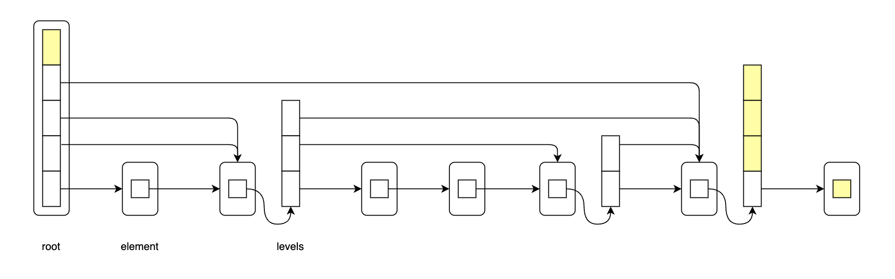

# gocontainer
gocontainer contains several optimized container implementations.

* Package databox stores byte data with fewer references and less memory fragmentation.
* Package heap implements generic heaps.
* Package skiplist implements a ranked skip list that supports repeated elements.
* Package uskiplist implements intrusive generic skiplists with low allocation and reference overhead.
* Package sortedmap implements generic sorted maps based on uskiplist.

Notes
-----

uskiplist uses a fixed probability of 0.25, so the expected skiplist level is
about 1.33 forward pointers per element. In this intrusive implementation, that
is stored as one embedded pointer plus occasional extra pointer arrays, averaging
about 1.58 pointer words per element.

Documentation
-------------

- [API Reference](http://godoc.org/github.com/someonegg/gocontainer)

Installation
------------

Install gocontainer using the "go get" command:

    go get github.com/someonegg/gocontainer
